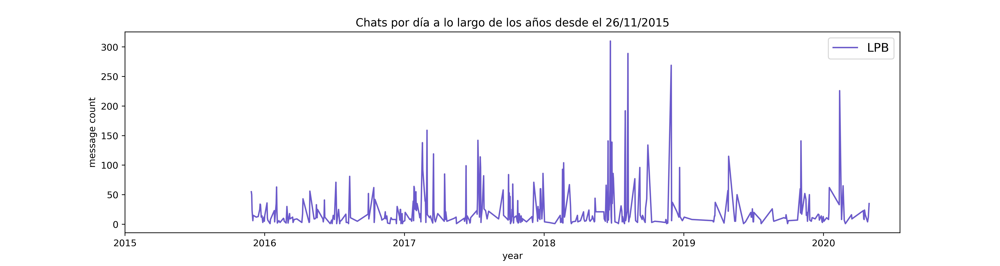

# WHATSAPP ANALYZER

Este es un pequeño proyecto personal con el objetivo de familiarizarme con el lenguaje de programación Python y varias de las librerías más usadas en ciencia de datos. El código está disponible en el repositorio. Este es un ejemplo de la evolución de mis chats en el grupo LPB desde que fue creado.  

Con este código, solo se requiere darle al programa:

* El nombre del archivo que sale de _Whatsapp -> Exportar chat
    * filename = "LPB.txt"
* El nombre de la otra persona (str) o la lista de nombres en un grupo, así como el nombre de uno.
    * others = ["Oco","Nacho","Mauro","Lorant"....]
    * me = "Santiago Olszevicki"

* El color con el que graficar. 
  * "indigo"

Los resultados, tras correr el código que se muestra en example.py:

# Nube de las palabras más usadas

# Cuántos mensajes mandó cada usuario

# Distribución de mensajes por hora (y por año, y por mes)

# Entre muchas otras posibilidades.

Disclaimer: el código está en desarrollo. 

