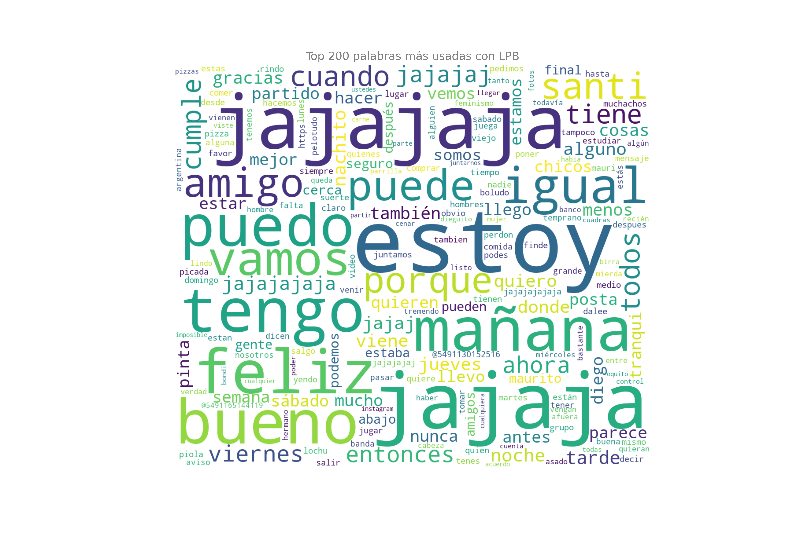
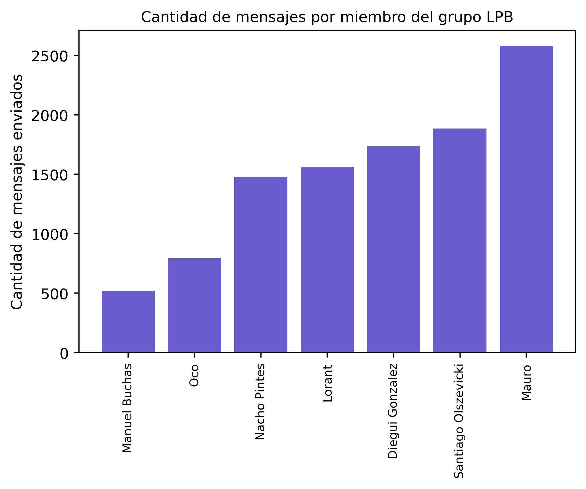
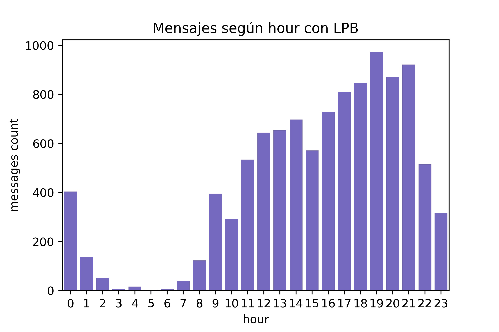

# WHATSAPP ANALYZER

Este es un pequeño proyecto personal con el objetivo de familiarizarme con el lenguaje de programación Python y varias de las librerías más usadas en ciencia de datos. El código está disponible en el repositorio. Este es un ejemplo de la evolución de mis chats en el grupo LPB desde que fue creado. Estas son las 200 palabras que más usamos. 

# Input 
Con este código, solo se requiere darle al programa:

* El nombre del archivo que sale de _Whatsapp -> Exportar chat
    * filename = "LPB.txt"
* El nombre de la otra persona (str) o la lista de nombres en un grupo, así como el nombre de uno.
    * others = ["Oco","Nacho","Mauro","Lorant"....]
    * me = "Santiago Olszevicki"

* El color con el que graficar. 
  * "indigo"

Las funciones que corren, así como el orden en el que recomiendo hacerlo, están en functions.py. 
Los resultados, tras correr el código que se muestra en example_1.py (_individual_) o example_2.py (_grupos_) son:

# Nube de las palabras más usadas

# Cuántos mensajes mandó cada usuario

# Distribución de mensajes por hora (y por año, y por mes)

# Más, todavía en desarrollo.

Si tenés dudas o sugerencias, escribime! 
https://www.linkedin.com/in/santiago-olszevicki-01a413125/

